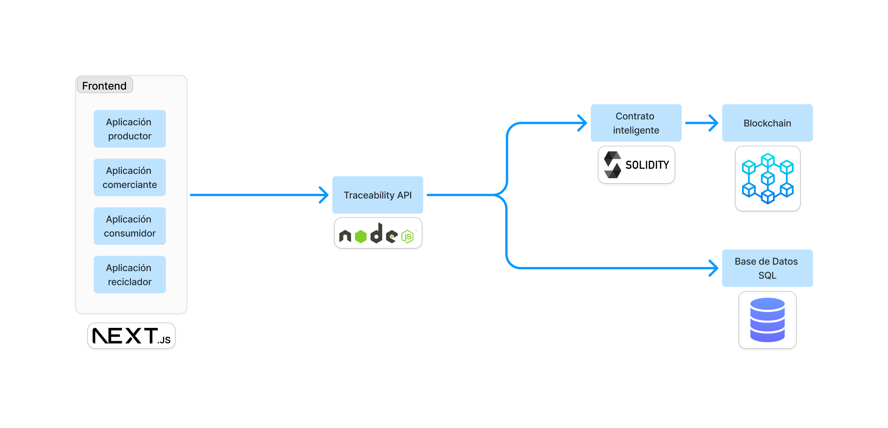
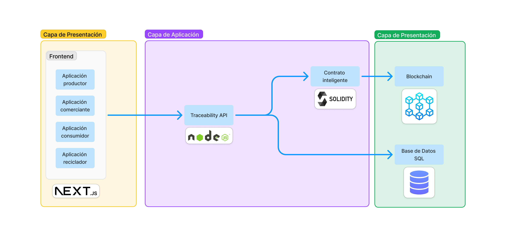

# Arquitectura de Software

## Resumen

### Alcance del proyecto

El alcance de este plan de tesina final de carrera se limita a la **investigación y desarrollo de un prototipo de aplicación** basado en tecnología blockchain, destinado a mejorar la trazabilidad en modelos de economía circular orientados al reciclado de vidrio.

El sistema permitirá registrar y auditar las transacciones de los residuos de vidrio a lo largo de toda la cadena de suministros, desde su generación hasta su disposición final.

Específicamente nos enfocaremos en la cadena de producción de envases de vidrio, dejando a libre implementación futura la integración con otros actores de la cadena de reciclaje de vidrio.

¿Por qué nos concentramos sólo en esta etapa? Porque en la investigación del estado del arte se descubrió que en la primera parte de la cadena no se encontraron soluciones tecnológicas que resuelvan este problema localmente. Mientras que en la segunda parte de la cadena, la recolección y reciclado de vidrio, ya existen soluciones tecnológicas que permiten mejorar la adopción y la eficiencia de los procesos, que pueden ser integradas en futuras etapas del proyecto.

### Alcance de arquitectura de la aplicación

1. Desarrollo de un contrato inteligente (o conjunto de contratos inteligentes) en Solidity para registrar información de envases de vidrio generados y su posterior trazabilidad.

2. Desarrollo de una interfaz web para interactuar con el contrato inteligente desde el punto de vista de los distintos actores y visualizar la información registrada en la blockchain.

3. Desarrollo de una base de datos para almacenar información adicional de los envases de vidrio generados y reciclados y otra información relevante para la trazabilidad o uso del software.

4. Desarrollo de una API para interactuar con la base de datos y el contrato inteligente.

5. Desarrollo de una API Pública y su documentación para permitir la integración con otros sistemas empresariales, gubernamentales o de terceros.

#### Justificación

Esta arquitectura se ha diseñado buscando maximizar la escalabilidad y flexibilidad. Consideramos que estas características son clave para manejar la trazabilidad en las cadenas de suministro, garantizando al mismo tiempo la integridad y la accesibilidad de los datos a través de diferentes actores del ecosistema. Eesta arquitectura no solo cumple con los requisitos técnicos y de negocio de la aplicación actual, sino que busca posicionar el sistema para escalabilidad futura, integración con sistemas nuevos o preexistentes y adaptación a nuevas necesidades o cambios de tecnología.

- Blockchain: Utilizar una tecnología de blockchain para registrar las operaciones garantiza no solo la seguridad y la transparencia, sino también la resistencia a la censura y la manipulación de los registros, factores cruciales cuando se manejan certificaciones y se verifica la procedencia de materiales sensibles en un entorno distribuido con múltiples actores con intereses diversos. Para mayor análisis, dirigirse a la sección de Tecnologías.

- Solidity: se eligió Solidity/Ethereum por ser una blockchain pública e interoperable y con una amplia comunidad de desarrolladores y herramientas disponibles para el desarrollo de contratos inteligentes y un lenguaje de programación simple para la creación de contratos inteligentes.

- Node.js en la API de trazabilidad: El uso de Node.js para desarrollar la API de trazabilidad se debe a que esta API debe comunicarse con la blockchain y actualmente Node.js cuenta con la mayor colección de librerías y herramientas que facilitan la interacción con la red Ethereum y redes compatibles con Solidity, además de una amplia comunidad detrás de estas herramientas. A su vez, Node.js es ideal para operaciones de I/O intensivas y para la gestión de múltiples conexiones simultáneas, lo cual es esencial para el procesamiento en tiempo real necesario en las operaciones de la API de trazabilidad. Esta API seguirá una arquitectura basada en Clean Architecture, que permite separar las capas de presentación, aplicación, dominio e infraestructura, facilitando la escalabilidad del sistema y la integración con otros sistemas de terceros.

- Base de Datos SQL: el uso de una base de datos SQL tradicional permite gestionar de manera eficiente los datos estructurados generados por las aplicaciones, facilitando operaciones complejas de consulta y análisis para la toma de decisiones estratégicas y operacionales por parte de las empresas y entidades regulatorias. A su vez, duplicar la información de la blockchain en una base de datos SQL permite garantizar la disponibilidad de los datos en caso de congestión en la red blockchain, a modo de caché para mejorar la velocidad de respuesta de las aplicaciones y reducir la latencia en la interacción con los usuarios. Esta base de datos se sincronizará con la blockchain a través de la API de trazabilidad, garantizando la consistencia y la integridad de los datos en ambos sistemas.

- Frontend con Next.js: Se ha optado por un frontend web usando el framework Next.js para generar una interfaz accesible desde todo tipo de dispositivos modernos (y no tan modernos), aprovechando la simplicidad de desarrollo que ofrece y la disponibilidad de librerías creadas por la comunidad para un desarrollo acelerado ideal para prototipos, aprovechando a su vez el rendimiento mejorado para el usuario final que ofrece el framework al combinar páginas estáticas con otras renderizadas en el servidor. Esto optimiza la carga y rendimiento de las aplicaciones de productor, comerciante, consumidor y reciclador, proporcionando una experiencia de usuario fluida y rápida, que es esencial para fomentar la adopción del sistema por usuarios con diversas competencias tecnológicas.

## Detalle

### Arquitectura del sistema

Diseño modular: Desarrollar con una arquitectura que favorezca módulos independientes facilita la mantenibilidad y la escalabilidad. Permite además una mejor distribución del trabajo en equipo.

Para este proyecto se decidió utilizar una macro-arquitectura modular, separando las responsabilidades en 3 capas principales:

1. **Capa de Presentación**: Interfaz de usuario web para interactuar con el sistema.
2. **Capa de Aplicación**: API de trazabilidad para interactuar con la blockchain y la base de datos.
3. **Capa de Dominio**: Contrato inteligente en Solidity para registrar la trazabilidad de los envases de vidrio y base de datos SQL para almacenar información adicional.

En este esquema, cada capa tiene una responsabilidad clara y se comunica con las otras capas a través de interfaces bien definidas. Esto permite que cada capa pueda ser desarrollada, probada y desplegada de forma independiente, facilitando la escalabilidad y la integración con otros sistemas.

La comunicación entre cada capa se realizará a través de APIs RESTful, que permiten una comunicación asíncrona y desacoplada entre los distintos componentes del sistema. Esto facilita la integración con otros sistemas y la escalabilidad del sistema, ya que cada capa puede ser desplegada en servidores independientes y comunicarse a través de la red. Incluso cada módulo puede ser reemplazado independientemente sin afectar al resto del sistema, siempre y cuando se respeten las interfaces definidas.

#### Capa de dominio

La interfaz de la capa de dominio es el contrato inteligente en Solidity, que se encarga de registrar la trazabilidad de los envases de vidrio generados y reciclados. Este contrato inteligente se desplegará en una red de blockchain pública o privada, según las necesidades de la aplicación. Esta interfaz no cambiará a lo largo del tiempo, ya que es la parte crítica y sensible del sistema, y cualquier cambio en ella podría afectar la integridad y la seguridad de los datos almacenados en la blockchain.

Para este prototipo es especialmente útil, ya que nos concentraremos especialmente en desarrollar la lógica de trazabilidad de los envases de vidrio en el contrato inteligente utilizando la blockchain como base de datos, pero el resto de las capas pueden ser desarrolladas y desplegadas por separado, permitiendo una mayor flexibilidad y adaptabilidad a futuras necesidades.

Es por este motivo que se decidió agregar una API de trazabilidad entre la capa de presentación y la capa de dominio junto con una base de datos SQL, para permitir la integración con otros sistemas sin tener que modificar el contrato inteligente en Solidity, que es la parte más crítica y sensible del sistema. El contrato inteligente poseerá su interfaz bien definida y documentada con la cuál podrá interactuar la API de trazabilidad para enviar y consultar información, pero esta interfaz no debería ser modificada a lo largo del tiempo, sino que se mantendrá estática y estable.

La forma de extender la funcionalidad del sistema será a través de la capa de aplicación, desarrollando nuevas funcionalidades en la API de trazabilidad y en la base de datos SQL, pero sin modificar el contrato inteligente en Solidity. Incluso en un futuro podrían desarrollarse múltiples APIs o cambiar el módulo completo de la API de trazabilidad sin tener que modificar el contrato inteligente, siempre y cuando se respete la interfaz definida.

Esto en macro es como un clean arch modular, con cada módulo remplazable y todas las comunicaciones por api rest.

Por qué api rest? Qué alternativas hay? API rest utiliza HTTP y JSON como protocolo de comunicación, lo que lo hace muy sencillo de implementar y de entender. Además, es un estándar de facto en la industria, lo que facilita la integración con otros sistemas y la reutilización de código. Otras alternativas podrían ser GraphQL, gRPC, WebSockets, etc. Pero para este proyecto se consideró que API REST era la mejor opción por su simplicidad y facilidad de implementación y futura escalabilidad en caso de que otros sistemas quieran integrarse con el nuestro en el futuro.

En la capa de aplicación elegimos hacer una sola api, estilo mono repo, para simplificar el desarrollo y la integración de los distintos módulos. En un futuro, si se requiere, se podría dividir en distintas apis para cada módulo, pero por ahora consideramos que es suficiente con una sola api. Para mantener el orden dentro de esta única api, utilizaremos una arquitectura basada en Clean Architecture, que nos permitirá separar las capas de presentación, aplicación, dominio e infraestructura, facilitando la escalabilidad del sistema y la integración con otros sistemas de terceros. (acá definir si clean u otra arquitectura).

La capa de presentación en este trabajo se implementó para poder dar una presentación visual del proyecto, pero en un futuro, cuando el sistema sea usado en producción, nuestra api se conectará directamente a aplicaciones preexistentes de los distintos actores de la cadena de suministro, como por ejemplo un sistema de gestión de producción de envases de vidrio, un sistema de gestión de ventas de envases de vidrio, un sistema de gestión de reciclado de envases de vidrio, etc. Incluso podríamos desarrollar aplicaciones a medida para cada actor a pedido si es necesario, ya que nuestra arquitectura lo permite.
